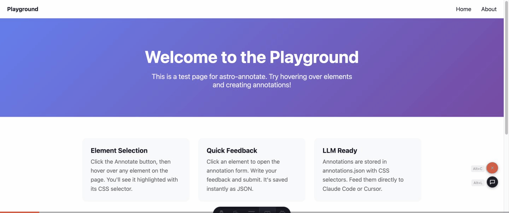

# astro-annotate

[](https://www.npmjs.com/package/astro-annotate)
[](https://www.npmjs.com/package/astro-annotate)
[](./LICENSE)
[](https://astro.build)

Visual annotation overlay for Astro staging sites. Clients and stakeholders annotate HTML elements directly in the browser. Annotations are stored as structured JSON, readable by developers and LLMs.

<p align="center">
  
</p>

> **Status:** Phase 1 (MVP) &mdash; local dev mode. Works with `astro dev`.

## Why astro-annotate?

- **Built for Astro** &mdash; `npx astro add`, Dev Toolbar icon, View Transitions support
- **Zero dependencies** &mdash; vanilla TypeScript client, ~15KB gzipped
- **LLM-native** &mdash; annotations saved as `annotations.json` with CSS selectors, feed directly to Claude Code or Cursor
- **No SaaS, no account** &mdash; everything stays in your repo, no third-party service
- **Shadow DOM isolated** &mdash; overlay UI never touches your site's styles

## Quick Start

```bash
npx astro add astro-annotate
```

<details>
<summary>Manual installation</summary>

```bash
npm install astro-annotate
```

```js
// astro.config.mjs
import { defineConfig } from 'astro/config';
import annotate from 'astro-annotate';

export default defineConfig({
  integrations: [annotate()],
});
```

</details>

## Features

- **Element-based annotations** &mdash; hover to highlight, click to annotate any HTML element
- **Figma-style pins** &mdash; small teardrops that point toward annotated elements with directional tilt
- **Draggable panel** &mdash; freely movable annotations panel with resize handle and snap-to-side docking
- **CSS selector tracking** &mdash; annotations reference elements by robust CSS selectors (IDs, data-testid, tag+class)
- **JSON storage** &mdash; annotations saved as `annotations.json`, directly readable by developers and LLMs
- **Astro Dev Toolbar** &mdash; native toolbar icon with notification badge for open annotations
- **Device detection** &mdash; automatically tags annotations as mobile/tablet/desktop

## Keyboard Shortcuts

| Shortcut | Action |
|----------|--------|
| `Alt + C` | Toggle annotation mode |
| `Alt + L` | Toggle annotations panel |
| `Escape` | Close topmost UI (form &rarr; detail &rarr; panel &rarr; exit mode) |
| `Ctrl + Enter` | Submit annotation |

## Reading Annotations

The `annotations.json` file is structured for both humans and machines:

```json
{
  "version": "1.0",
  "annotations": [
    {
      "id": "abc123",
      "page": "/",
      "selector": "h1.hero-title",
      "text": "Make this headline shorter",
      "author": "Client Name",
      "status": "open",
      "device": "desktop",
      "viewport": { "width": 1440, "height": 900 }
    }
  ]
}
```

## Configuration

| Option | Default | Description |
|--------|---------|-------------|
| `enabled` | `true` in dev | Enable the annotation overlay |
| `storage` | `'local'` | Storage backend |
| `annotationsPath` | `'./annotations.json'` | Path to the annotations file |

```js
annotate({
  enabled: true,
  storage: 'local',
  annotationsPath: './annotations.json',
})
```

## Roadmap

- **Phase 2:** Deployed mode on Cloudflare Pages with password auth
- **Phase 3:** Screenshots, CLI export, mobile UX, docs

## Contributing

Contributions welcome! See [CONTRIBUTING.md](./CONTRIBUTING.md) for setup instructions.

## License

MIT
